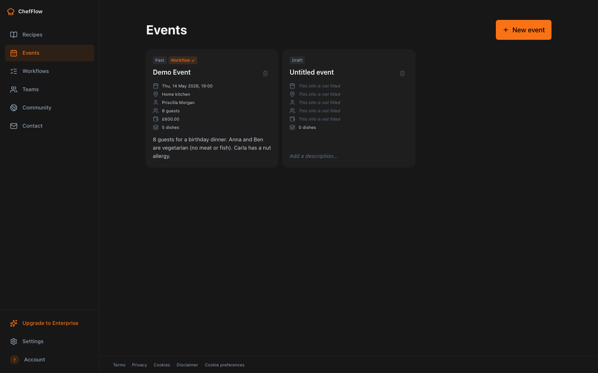
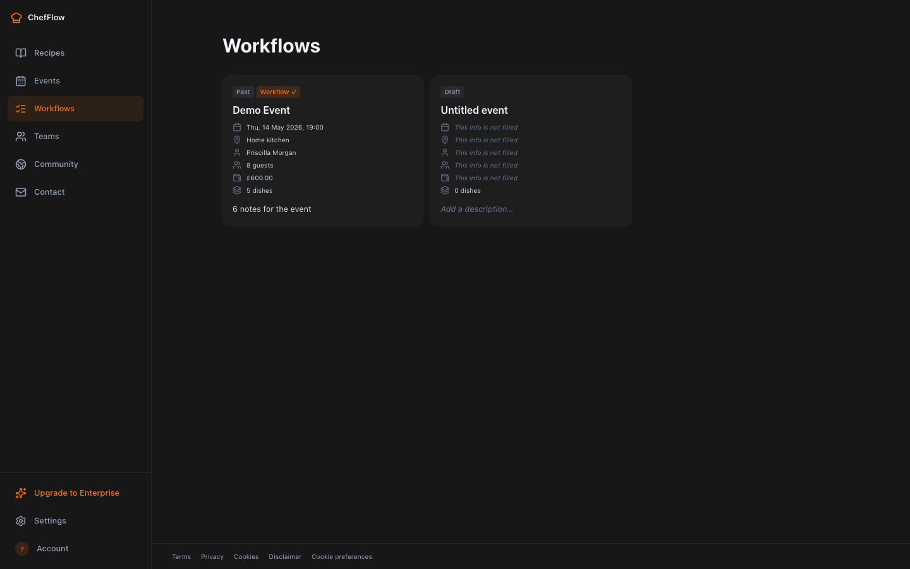

# ChefFlow

> Kitchen ops for professional chefs — recipes, events, allergens, and AI-built prep timelines, all in one mobile-first PWA.

ChefFlow turns a chef's scattered notes (phone, notebook, printed sheet pinned to the wall) into one structured workspace: scaled recipes, allergen-aware events, and an LLM-generated prep-to-plate workflow for every service. Built for the UK 14-allergen taxonomy, optimised for greasy-hands kitchen use.

Live at **[chefflow.uk](https://chefflow.uk)** — free during private beta.

---

## Screenshots

| Events library (with at-a-glance metadata) | Per-event workflow timeline |
|:--:|:--:|
|  |  |

More: see [`docs/ux-audit-2026-06-02/`](docs/ux-audit-2026-06-02/) for desktop + mobile captures of every surface.

---

## Features

- **Recipes** — portion scaling that locks salt/seasoning so they don't multiply when you scale 4 → 40 covers
- **Events** — dishes + guest count + budget; allergen + dietary check across the menu
- **Workflow scheduler** — LLM takes every dish on the event and builds one prep-to-plate timeline; prep/cook/serve phases, per-chef colour coding, drag-to-reorder
- **UK 14 allergen taxonomy** — per-ingredient flags that inherit through sub-recipes; immutable audit log for every removal
- **Team sharing** — head chef shares recipes/events with sous + line cooks; members get an email when something new lands
- **Community library** — chefs publish recipes; others can like + copy
- **Offline-first** — Dexie/IndexedDB stores everything locally; sync runs to Cloudflare D1 when online
- **PWA** — install on phones/tablets, runs in service
- **AI helpers** — generate a recipe from text, analyse a menu for dietary fit, draft a kitchen schedule

---

## Tech Stack

**Frontend** Vite · React 18 · TypeScript · Tailwind · Dexie (IndexedDB) · Zustand · React Router · Lucide icons
**Backend** Cloudflare Workers · D1 (SQL) · KV · Workers AI
**Integrations** Clerk (auth) · Stripe (billing) · Resend (email) · Groq (Llama 3.3 70B) · Google Maps (Places + Distance Matrix)
**Testing** Vitest · Playwright · Testing Library
**Deployment** Cloudflare Pages (SPA) · Wrangler (Worker)

---

## System Architecture

Monorepo with two deployable units:

```
                    ┌─────────────────────────────┐
                    │      chefflow.uk (PWA)      │
   chef ──HTTPS──▶  │  Vite + React SPA           │
                    │  Dexie (offline-first)      │
                    └──────┬──────────────┬───────┘
                           │              │
                           │ Clerk JWT    │ Stripe Checkout
                           │              │
                    ┌──────▼──────────────▼───────┐
                    │   api.chefflow.uk (Worker)  │
                    │   - /api/sync/{pull,push}   │
                    │   - /api/llm/*  (proxied)   │
                    │   - /api/teams/*            │
                    │   - /api/community/*        │
                    │   - /billing/*  (Stripe)    │
                    │   - /webhook/stripe         │
                    └──┬──────┬──────┬──────┬─────┘
                       │      │      │      │
                       ▼      ▼      ▼      ▼
                      D1     KV   Resend   Groq
                  (sync)  (rate) (email) (LLM)
```

**Data flow:**

- Chef edits a recipe → Dexie write (offline OK) → SyncRunner pushes delta to D1 via `/api/sync/push`
- On sign-in/refresh → SyncRunner pulls deltas via `/api/sync/pull?since=<ts>` → merged into Dexie
- LWW (last-write-wins) per row; `updated_at` is the conflict-resolution key
- Team-shared rows are pulled with `owner_user_id` + `read_only` set so the SPA gates editing
- LLM calls go via the worker proxy at `/api/llm/<endpoint>` — quota-gated per tier, fallback chain Groq → Workers AI

**Demo seeding:** first sign-in triggers `POST /api/demos/provision` → worker checks a KV gate per user → if unprovisioned, seeds ~10 demo recipes + 1 demo event into D1 → next sync pull surfaces them in the SPA. Idempotent.

---

## File Structure

```
chefflow/                           ← SPA (Vite + React)
├── src/
│   ├── ui/
│   │   ├── pages/                  ← 32 page components (RecipesLibrary, EventEditor, Workflow…)
│   │   ├── components/             ← 83 shared components (RecipeCard, EventCard, AllergenPill…)
│   │   ├── layout/                 ← App shell + side nav
│   │   └── theme/                  ← Dark mode + text-size hooks
│   ├── core/
│   │   ├── recipes/                ← Markdown parser, scaler, allergen taxonomy
│   │   ├── scheduler/              ← Workflow timeline builder + LLM client
│   │   ├── events/                 ← Event utils, allergy keywords
│   │   ├── sync/                   ← Delta engine + first-sign-in migration
│   │   ├── tier/                   ← TIER_LIMITS, parseTier, quota client
│   │   ├── units/                  ← Metric/Imperial conversion engine
│   │   └── …                       ← teams, community, demos, auth, billing, contact
│   ├── db/                         ← Dexie schema + per-table repos
│   ├── state/                      ← Zustand stores (tier, sync, profile, pin…)
│   └── App.tsx, main.tsx           ← Router + bootstrap
├── e2e/                            ← Playwright specs (24 tests)
├── tailwind.config.ts
└── package.json

chefflow-worker/                    ← Cloudflare Worker (D1 + KV + LLM proxy)
├── src/
│   ├── index.ts                    ← HTTP router (36 routes) + cron dispatcher
│   ├── sync.ts                     ← Pull/push engine, LWW per row
│   ├── teams.ts                    ← Invites, accepts, groups
│   ├── community.ts                ← Publish, like, copy
│   ├── billing.ts, stripeWebhook.ts← Stripe Checkout + subscription events
│   ├── auth.ts, tier.ts            ← Clerk JWT verify, tier resolution
│   ├── contactMail.ts, shareMail.ts← Resend transactional email
│   ├── demos.ts, demoSeed.ts       ← Demo provisioning
│   ├── quota.ts                    ← KV-backed daily quotas
│   ├── groqClient.ts, aiCall.ts    ← LLM clients (Groq + Workers AI)
│   └── …                           ← admin, onboarding, allergenAudit, pinRecovery
├── migrations/                     ← D1 SQL migrations (recipes, events, menus, audits, teams, groups)
├── wrangler.toml
└── package.json

docs/                               ← Architecture, data model, ops guides, UX audits
.github/workflows/                  ← Playwright + Vitest CI
CLAUDE.md                           ← Engineering rules (kept for contributors)
CONTRIBUTING.md                     ← Contribution guide
LICENSE                             ← MIT
```

---

## Quick Start

**Prerequisites:** Node 20+, npm, a Cloudflare account (free tier), a Clerk account (dev tier), optionally Groq + Stripe + Resend keys.

```bash
git clone https://github.com/dereks1109/chefflow.git
cd chefflow

# 1. SPA
cd chefflow
npm install
cp .env.production .env.local         # then edit .env.local with your keys
npm run dev                           # http://localhost:5173

# 2. Worker (in a second terminal)
cd ../chefflow-worker
npm install
# create .dev.vars with your secrets (see Configuration below)
npx wrangler dev                      # http://localhost:8787
```

The SPA boots in offline-only mode if the worker is down — you can still create recipes and events locally without any backend. Sign in via Clerk to unlock sync, sharing, and LLM features.

---

## Configuration

### SPA env vars (`chefflow/.env.local` or Cloudflare Pages dashboard)

| Var | Required | Purpose |
|---|---|---|
| `VITE_CLERK_PUBLISHABLE_KEY` | ✅ | Clerk publishable key — safe in client bundle. Use the dev `pk_test_…` for local. |
| `VITE_WORKER_BASE_URL` | ✅ | Where the SPA POSTs API calls. `http://localhost:8787` locally, `https://api.chefflow.uk` in prod. |
| `VITE_LLM_MODE` | optional | `proxy` (default) routes LLM calls through the worker. `direct` lets each chef paste their own Groq key. |
| `VITE_GOOGLE_MAPS_API_KEY` | optional | Places autocomplete (Settings + Event location). MUST be HTTP-referrer-restricted in Google Cloud Console. |

### Worker env vars + secrets (`chefflow-worker/wrangler.toml` + `wrangler secret put`)

| Var | Type | Required | Purpose |
|---|---|---|---|
| `CLERK_ISSUER` | env | ✅ | Clerk issuer URL (e.g. `https://your-app.clerk.accounts.dev`) |
| `CLERK_SECRET_KEY` | secret | ✅ | For JWT verification + user metadata writes |
| `STRIPE_SECRET_KEY` | secret | for billing | Stripe API key |
| `STRIPE_WEBHOOK_SECRET` | secret | for billing | Stripe webhook signing secret |
| `STRIPE_PRICE_ID_PRO_MONTHLY` | secret | for billing | Stripe Price ID for Pro monthly |
| `STRIPE_PRICE_ID_PRO_ANNUAL` | secret | for billing | Stripe Price ID for Pro annual |
| `RESEND_API_KEY` | secret | for email | Resend API key; without it, contact form + share emails are no-ops |
| `GROQ_API_KEY` | secret | for LLM | Groq API key; falls back to Workers AI if missing |
| `GOOGLE_MAPS_API_KEY` | secret | for commute | Distance Matrix API key (worker-only, NO referrer restriction) |

### Beta knob

[`chefflow/src/core/tier/limits.ts`](chefflow/src/core/tier/limits.ts) has a `FORCE_PRO_DURING_BETA` constant. While `true`, every signed-in user without explicit Clerk tier metadata resolves as `pro`. Flip to `false` before charging real customers.

---

## CLI Commands

### SPA (`chefflow/`)

| Command | What it does |
|---|---|
| `npm run dev` | Vite dev server on `http://localhost:5173` |
| `npm run build` | Type-check + Vite production build into `dist/` |
| `npm run test` | Vitest watch mode |
| `npm run test:run` | Vitest one-shot (CI mode) |
| `npm run test:e2e` | Playwright headless |
| `npm run lint` | ESLint over all `.ts` / `.tsx` |
| `npm run preview` | Build + serve locally |
| `npx tsc --noEmit` | Type-check only |

### Worker (`chefflow-worker/`)

| Command | What it does |
|---|---|
| `npm run dev` | Wrangler dev server on `http://localhost:8787` |
| `npm test` | Vitest unit tests |
| `npm run typecheck` | TypeScript `--noEmit` |
| `npm run deploy` | `wrangler deploy` to production |
| `npx wrangler secret put NAME` | Set a secret in the production worker |
| `npx wrangler d1 migrations apply chefflow-sync` | Run D1 migrations |

---

## API Endpoints

All routes live in [`chefflow-worker/src/index.ts`](chefflow-worker/src/index.ts). Grouped by auth requirement:

### Public (no auth)

| Method | Path | Purpose |
|---|---|---|
| `POST` | `/webhook/stripe` | Stripe subscription events → tier updates |
| `GET` | `/demos/list` | Public demo feed |
| `GET` | `/community/list` | Paginated community recipe feed |
| `POST` | `/contact/submit` | Contact form → Resend email |
| `POST` | `/admin/bootstrap` | One-shot first-admin setup (token-gated) |

### Auth-gated (Clerk JWT required)

| Method | Path | Purpose |
|---|---|---|
| `GET` | `/api/sync/pull?since=<ms>` | Delta pull from D1 |
| `POST` | `/api/sync/push` | Delta push with LWW |
| `POST` | `/api/llm/<endpoint>` | LLM proxy — quota-enforced per tier |
| `POST` | `/api/commute/estimate` | Google Maps distance matrix |
| `POST` | `/api/demos/provision` | Seed demos (idempotent) |
| `POST` | `/api/teams/invite` | Invite team member |
| `POST` | `/api/teams/accept` | Accept invite |
| `GET` | `/api/teams/list` | Teams I'm a member of |
| `GET` | `/api/teams/owners-of-me` | Owners sharing rows with me |
| `GET`, `POST` | `/api/teams/groups` | List / create / rename groups |
| `POST` | `/api/onboarding/complete` | Save onboarding profile |
| `POST` | `/api/community/{publish,report}` + `/community/<id>/{like,copy}` | Community workflows |
| `GET` | `/api/account/export` | JSON data dump |
| `DELETE` | `/api/account` | Account erasure + subscription cancel |
| `POST`/`GET` | `/quota/{consume,snapshot}` | Quota check + snapshot |
| `POST` | `/pin/recovery/{request,verify}` | PIN reset flow |
| `POST` | `/billing/{checkout-session,cancel-subscription,portal-session}` | Stripe flows |
| `POST` | `/audit/allergen-removal` | Append to immutable audit log |

### Admin (Clerk JWT + `tier === 'admin'`)

`GET /admin/{members,metrics,activity,contact-submissions,allergen-audits,d1/allergen-audits}` + `GET /admin/takedown-reports` + `POST /admin/cron/run`.

### Cron (daily 08:00 UTC, `wrangler.toml [triggers]`)

Combined digest job — sweeps Gmail inbox + contact submissions, emails `admin@chefflow.uk` via Resend.

---

## Testing

```bash
# SPA unit + integration (Vitest)
cd chefflow && npm run test:run                    # all 693 specs
npx vitest run src/ui/pages/SettingsPage.test.tsx  # one file

# Worker unit (Vitest)
cd chefflow-worker && npm test                     # all 267 specs

# E2E (Playwright)
cd chefflow && npm run test:e2e                    # all 24 specs
npx playwright test e2e/allergen-flow.spec.ts      # one file
```

E2E specs seed their own IndexedDB fixtures before each test — they don't need a running worker. See [`chefflow/e2e/TEST_CASES.md`](chefflow/e2e/TEST_CASES.md) for the testing conventions.

---

## Deployment

- **SPA → Cloudflare Pages** — auto-deploys on push to `main`. Build command `npm run build`, output `chefflow/dist/`. Env vars in the Pages dashboard.
- **Worker → Cloudflare Workers** — manual deploy via `cd chefflow-worker && npm run deploy`. Wrangler reads `wrangler.toml` for bindings + secrets via `wrangler secret put`.

The two deploy independently. The SPA degrades gracefully when the worker is unreachable (offline mode kicks in, sync queues writes locally).

---

## Project Status

ChefFlow is in **private beta**. Every signed-in user defaults to the Pro tier via the `FORCE_PRO_DURING_BETA` knob (see Configuration). Stripe billing is wired but dormant — no charges until public launch.

Roadmap + active backlog in [`ToDoList.md`](ToDoList.md). The build is shipped iteratively with strict CLAUDE.md rules (see [`CLAUDE.md`](CLAUDE.md)).

---

## Contributing

Issues + PRs welcome — see [`CONTRIBUTING.md`](CONTRIBUTING.md) for the dev workflow, a curated list of good first PRs (allergen translations, starter recipes, accessibility audits, E2E gaps), and a list of subsystems that are NOT good first-PR targets (sync engine, Stripe billing, tier gating).

Non-code contributions are equally welcome:

- **Bug reports + UX feedback** via GitHub Issues
- **Community recipes** — chefs can publish via the in-app Community feature
- **Translations** of allergen + unit copy

---

## License

[MIT](LICENSE). Copyright (c) 2026 ChefFlow.

---

## Disclaimer

ChefFlow surfaces allergen information that chefs declare on their own recipes — it is **not** a regulatory food-safety system. Always verify allergens against your supplier paperwork. The immutable audit log records intent, not certification.

The software is provided **AS IS** without warranty of any kind. See [LICENSE](LICENSE) for the full disclaimer text.

---

## Acknowledgements

Built almost entirely via [Claude Code](https://claude.com/claude-code) using a strict CLAUDE.md ruleset (test-first, surgical changes, fail loud). Open-sourcing the codebase + the build process for anyone curious about real-world vibe coding at production scale.
