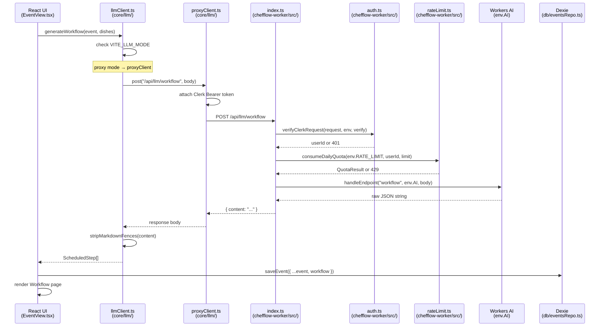

# Architecture

## System overview

ChefFlow has three runtime components:

```
┌──────────────────────────────────────────────────────────┐
│  Browser                                                  │
│  ┌────────────────────────────────────────────────────┐  │
│  │  Vite SPA  (chefflow/)                             │  │
│  │  React 19 + React Router 7 + Tailwind CSS          │  │
│  │                                                    │  │
│  │  Clerk <SignedIn>/<SignedOut> auth gate             │  │
│  │  Zustand — unit system global state                │  │
│  │  Dexie (IndexedDB) — offline recipe/event storage  │  │
│  │                                                    │  │
│  │  LLM calls ──► /api/llm/* (proxy mode)             │  │
│  │           or ──► api.groq.com (dev mode)           │  │
│  └──────────────────────────┬─────────────────────────┘  │
└─────────────────────────────│────────────────────────────┘
                              │ HTTPS POST /api/llm/{endpoint}
                              ▼
┌─────────────────────────────────────────────────────────┐
│  Cloudflare Pages (production)                          │
│  Serves the Vite build; routes /api/llm/* to Worker     │
│                                                         │
│  ┌───────────────────────────────────────────────────┐  │
│  │  chefflow-worker  (Cloudflare Worker)             │  │
│  │  Verifies Clerk JWT → consumeDailyQuota (KV)      │  │
│  │  → Workers AI binding (llama-3.3-70b / llama-3.2) │  │
│  └───────────────────────────────────────────────────┘  │
└─────────────────────────────────────────────────────────┘
```

### LLM mode switching

The SPA checks `import.meta.env.VITE_LLM_MODE` at call time (`chefflow/src/core/llm/llmClient.ts`):

- `VITE_LLM_MODE=proxy` (production): calls `proxyClient.ts`, which POSTs to `/api/llm/{endpoint}` with a Clerk Bearer token. No API key is present in the browser bundle.
- Any other value (local dev): calls `groqClient.ts` directly with `VITE_GROQ_API_KEY`.

## Data flow

```
User action (UI)
    │
    ▼
React component (pages/ or components/)
    │
    ├── Read:  Dexie repo (db/recipesRepo.ts, db/eventsRepo.ts)
    ├── Write: Dexie repo (same files)
    │
    └── LLM:  core/llm/llmClient.ts
                  ├── groq path:  core/scheduler/llm/groqClient.ts  → api.groq.com
                  └── proxy path: core/llm/proxyClient.ts           → /api/llm/*
                                                                         │
                                                                         ▼
                                                             chefflow-worker/src/index.ts
                                                               verifyClerkRequest()
                                                               consumeDailyQuota()
                                                               handleEndpoint() → env.AI.run()
```

## Folder tree

```
chefflow/
├── src/
│   ├── App.tsx                    Entry point: route definitions, Clerk gate, seed bootstrap
│   ├── index.css                  Global CSS utilities (touch-target, btn, input, skeleton)
│   │
│   ├── core/                      Pure business logic — no React imports
│   │   ├── types.ts               Canonical domain types (Recipe, KitchenEvent, WorkflowStep, …)
│   │   ├── units/
│   │   │   ├── convert.ts         Unit conversion arithmetic (Decimal.js)
│   │   │   └── normalize.ts       Chef-friendly rounding + metric/imperial normalization
│   │   ├── scaler/
│   │   │   └── scaleRecipe.ts     Linear portion scaler (respects isLocked)
│   │   ├── parser/
│   │   │   ├── parseRecipe.ts     Markdown → Recipe object (gray-matter + regex)
│   │   │   └── serializeRecipe.ts Recipe object → Markdown
│   │   ├── scheduler/
│   │   │   ├── scheduleEvent.ts   Deterministic workflow scheduler (test oracle)
│   │   │   ├── rules.ts           Culinary rule evaluators
│   │   │   ├── hash.ts            Dish list hash for workflow staleness detection
│   │   │   └── llm/
│   │   │       ├── groqClient.ts  Direct Groq API client (multimodal)
│   │   │       ├── llmScheduler.ts LLM-driven workflow generator
│   │   │       ├── prompt.ts      Scheduler system prompt (imports CulinaryRule.md?raw)
│   │   │       └── responseSchema.ts Zod-like schema for LLM scheduler output
│   │   ├── recipes/
│   │   │   └── llm/
│   │   │       ├── recipeGen.ts   LLM recipe generation
│   │   │       ├── allergens.ts   UK-14 allergen detection helpers
│   │   │       └── recipeGenPrompt.ts  Recipe generation system prompt
│   │   ├── events/
│   │   │   ├── sections.ts        Section/dish grouping helpers
│   │   │   └── llm/
│   │   │       ├── menuCheck.ts   LLM menu suitability check
│   │   │       └── eventGen.ts    LLM event generation
│   │   ├── llm/
│   │   │   ├── llmClient.ts       Mode-switching facade (proxy vs groq)
│   │   │   └── proxyClient.ts     Cloudflare Worker proxy client
│   │   └── util/
│   │       ├── id.ts              randomId() helper
│   │       ├── money.ts           formatGBP() currency formatter
│   │       └── googleMapsLoader.ts Lazy Google Maps JS API loader
│   │
│   ├── db/                        Dexie IndexedDB layer
│   │   ├── dexie.ts               Database class + schema versions 1–3
│   │   ├── recipesRepo.ts         CRUD helpers for recipes table
│   │   ├── eventsRepo.ts          CRUD helpers for events table
│   │   └── seed.ts                Demo data seeded on first load
│   │
│   └── ui/
│       ├── theme/
│       │   └── useTheme.ts        Dark/light toggle hook + localStorage persistence
│       ├── layout/
│       │   ├── AppLayout.tsx      Root layout: TopNav + MobileTopBar + BottomNav + CommandPalette
│       │   ├── TopNav.tsx         Desktop navigation bar
│       │   ├── MobileTopBar.tsx   Mobile header bar
│       │   └── BottomNav.tsx      Mobile bottom tab bar (Recipes / Events / Workflows)
│       ├── pages/
│       │   ├── RecipesLibrary.tsx Browsable list of all recipes
│       │   ├── RecipeEditor.tsx   Create / edit a recipe (Markdown editor + ingredient rows)
│       │   ├── EventsLibrary.tsx  List of kitchen events
│       │   ├── EventView.tsx      Read-only event overview with dish timeline
│       │   ├── EventEditor.tsx    Create / edit an event (dishes, sections, budget, contact)
│       │   ├── WorkflowsLibrary.tsx  List of events that have a saved workflow
│       │   ├── Workflow.tsx       Workflow detail: scheduled steps, DnD reorder, color tags
│       │   └── KitchenPlaceholder.tsx  Stub for future live cooking mode
│       └── components/
│           ├── primitives/        Low-level presentational atoms
│           │   ├── Button.tsx
│           │   ├── Card.tsx
│           │   ├── Input.tsx
│           │   └── Surface.tsx
│           ├── CommandPalette.tsx Cmd-K fuzzy navigation overlay
│           ├── ThemeToggle.tsx    Sun/Moon icon button (calls useTheme)
│           ├── RecipeCard.tsx     Recipe list item card
│           ├── IngredientRow.tsx  Editable ingredient row with allergen badge
│           ├── StepRow.tsx        Editable workflow step row
│           ├── DishForm.tsx       Dish create/edit form
│           ├── DishRow.tsx        Dish list item row
│           ├── EventCard.tsx      Event list item card
│           ├── MenuCheckPanel.tsx LLM menu suitability result panel
│           ├── GenerateEventSheet.tsx  LLM event generation bottom sheet
│           ├── GenerateRecipeSheet.tsx LLM recipe generation bottom sheet
│           ├── LocationAutocomplete.tsx Google Maps Places autocomplete
│           ├── LlmSettingsSheet.tsx  Groq API key + model configuration sheet
│           ├── AllergenBadge.tsx  Allergen tag pill
│           ├── AnalysisSection.tsx  Recipe analysis display
│           ├── ColorPicker.tsx    Dish/step color tag picker
│           ├── NestedDragDropBuilder.tsx  DnD template (demo page)
│           ├── TimePicker.tsx     Time input widget
│           └── SignInScreen.tsx   Clerk sign-in wrapper

chefflow-worker/
├── src/
│   ├── index.ts          Worker entry: CORS, auth, rate-limit, dispatch
│   ├── auth.ts           Clerk JWT verification
│   ├── rateLimit.ts      Per-user daily quota via Workers KV
│   ├── endpoints.ts      Route dispatch (generate/analyze/photo/workflow)
│   ├── aiCall.ts         Workers AI binding wrapper
│   └── types.ts          ProxyRequestBody/ProxyResponseBody, model constants
└── wrangler.toml         Worker name, AI binding, KV namespace, vars

CulinaryRule.md            Six culinary scheduling rules bundled into LLM prompts
```

## State management

| Concern | Mechanism | Location |
|---------|-----------|----------|
| Unit system (Metric/Imperial/Auto) | Zustand store | `chefflow/src/state/unitSystemStore.ts` |
| Theme (dark/light) | `localStorage` + React state | `chefflow/src/ui/theme/useTheme.ts` |
| Recipes and events | IndexedDB via Dexie | `chefflow/src/db/` |
| Auth session | Clerk React SDK | Wraps the entire component tree in `App.tsx` |

## Routing

React Router 7 defines all routes in `chefflow/src/App.tsx`. Every route is wrapped inside `<SignedIn>` — unauthenticated users see only `<SignInScreen />`.

| Path | Page |
|------|------|
| `/` | Redirects to `/recipes` |
| `/recipes` | RecipesLibrary |
| `/recipes/:id/edit` | RecipeEditor |
| `/events` | EventsLibrary |
| `/events/:id` | EventView |
| `/events/:id/edit` | EventEditor |
| `/events/:id/cook` | KitchenPlaceholder (stub) |
| `/workflows` | WorkflowsLibrary |
| `/workflows/:eventId` | Workflow |
| `/demo/nested-dnd` | NestedDndDemo |

## Request lifecycle (Mermaid)

The diagram below traces a "Generate workflow" LLM request end to end, covering the proxy path (`VITE_LLM_MODE=proxy`).


