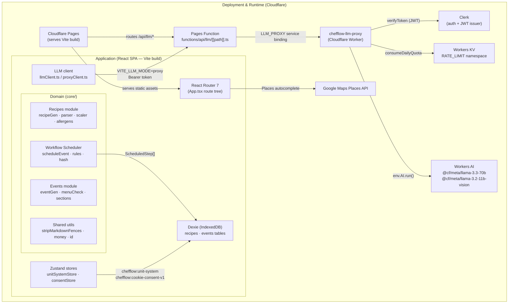
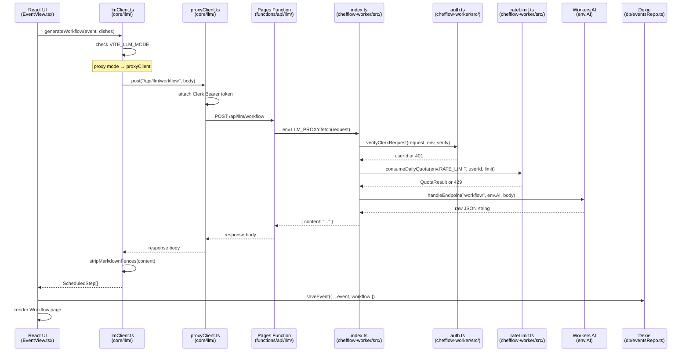

# Architecture

## Structure overview (nested-layer diagram)

The diagram below uses nested subgraphs to show how deployment, application, and domain layers
contain and communicate with one another. Edges are limited to the ten most load-bearing
relationships; see subsequent sections for the full call-path detail.



## System overview

ChefFlow has three runtime components:

```
┌──────────────────────────────────────────────────────────┐
│  Browser                                                  │
│  ┌────────────────────────────────────────────────────┐  │
│  │  Vite SPA  (chefflow/)                             │  │
│  │  React 19 + React Router 7 + Tailwind CSS          │  │
│  │                                                    │  │
│  │  Clerk <SignedIn>/<SignedOut> auth gate             │  │
│  │  Zustand — unit system + consent global state      │  │
│  │  Dexie (IndexedDB) — offline recipe/event storage  │  │
│  │                                                    │  │
│  │  LLM calls ──► /api/llm/* (proxy mode)             │  │
│  │           or ──► api.groq.com (dev mode)           │  │
│  └──────────────────────────┬─────────────────────────┘  │
└─────────────────────────────│────────────────────────────┘
                              │ HTTPS POST /api/llm/{endpoint}
                              ▼
┌─────────────────────────────────────────────────────────┐
│  Cloudflare Pages (production)                          │
│  Serves the Vite build; routes /api/llm/* via           │
│  Pages Function → LLM_PROXY service binding             │
│                                                         │
│  ┌───────────────────────────────────────────────────┐  │
│  │  chefflow-llm-proxy  (Cloudflare Worker)          │  │
│  │  Verifies Clerk JWT → consumeDailyQuota (KV)      │  │
│  │  → Workers AI binding (llama-3.3-70b / llama-3.2) │  │
│  └───────────────────────────────────────────────────┘  │
└─────────────────────────────────────────────────────────┘
```

### LLM mode switching

The SPA checks `import.meta.env.VITE_LLM_MODE` at call time (`chefflow/src/core/llm/llmClient.ts`):

- `VITE_LLM_MODE=proxy` (production): calls `proxyClient.ts`, which POSTs to `/api/llm/{endpoint}` with a Clerk Bearer token. No API key is present in the browser bundle.
- Any other value (local dev): calls `groqClient.ts` directly with `VITE_GROQ_API_KEY`.

The Cloudflare Pages layer sits between the SPA and the worker. `functions/api/llm/[[path]].ts` is a Pages Function catch-all that forwards every `/api/llm/*` request to the worker via an `LLM_PROXY` service binding — no external HTTP hop between the Pages layer and the worker.

## Data flow

```
User action (UI)
    │
    ▼
React component (pages/ or components/)
    │
    ├── Read:  Dexie repo (db/recipesRepo.ts, db/eventsRepo.ts)
    ├── Write: Dexie repo (same files)
    │
    └── LLM:  core/llm/llmClient.ts
                  ├── groq path:  core/scheduler/llm/groqClient.ts  → api.groq.com
                  └── proxy path: core/llm/proxyClient.ts           → /api/llm/*
                                                                         │
                                                                         ▼
                                                             Pages Function (functions/api/llm/[[path]].ts)
                                                               env.LLM_PROXY.fetch(request)
                                                                         │
                                                                         ▼
                                                             chefflow-worker/src/index.ts
                                                               verifyClerkRequest()
                                                               consumeDailyQuota()
                                                               handleEndpoint() → env.AI.run()
```

## Folder tree

```
chefflow/
├── src/
│   ├── App.tsx                    Entry point: route definitions, Clerk gate, seed bootstrap
│   ├── index.css                  Global CSS utilities (touch-target, btn, input, skeleton)
│   │
│   ├── core/                      Pure business logic — no React imports
│   │   ├── types.ts               Canonical domain types (Recipe, KitchenEvent, WorkflowStep, …)
│   │   ├── units/
│   │   │   ├── convert.ts         Unit conversion arithmetic (Decimal.js)
│   │   │   └── normalize.ts       Chef-friendly rounding + metric/imperial normalization
│   │   ├── scaler/
│   │   │   └── scaleRecipe.ts     Linear portion scaler (respects isLocked)
│   │   ├── parser/
│   │   │   ├── parseRecipe.ts     Markdown → Recipe object (gray-matter + regex)
│   │   │   └── serializeRecipe.ts Recipe object → Markdown
│   │   ├── scheduler/
│   │   │   ├── scheduleEvent.ts   Deterministic workflow scheduler (test oracle)
│   │   │   ├── rules.ts           Culinary rule evaluators
│   │   │   ├── hash.ts            Dish list hash for workflow staleness detection
│   │   │   └── llm/
│   │   │       ├── groqClient.ts  Direct Groq API client (multimodal)
│   │   │       ├── llmScheduler.ts LLM-driven workflow generator
│   │   │       ├── prompt.ts      Scheduler system prompt (imports CulinaryRule.md?raw)
│   │   │       └── responseSchema.ts Zod-like schema for LLM scheduler output
│   │   ├── recipes/
│   │   │   └── llm/
│   │   │       ├── recipeGen.ts   LLM recipe generation
│   │   │       ├── allergens.ts   UK-14 allergen detection helpers
│   │   │       └── recipeGenPrompt.ts  Recipe generation system prompt
│   │   ├── events/
│   │   │   ├── sections.ts        Section/dish grouping helpers
│   │   │   └── llm/
│   │   │       ├── menuCheck.ts   LLM menu suitability check
│   │   │       └── eventGen.ts    LLM event generation
│   │   ├── llm/
│   │   │   ├── llmClient.ts       Mode-switching facade (proxy vs groq)
│   │   │   └── proxyClient.ts     Cloudflare Worker proxy client
│   │   └── util/
│   │       ├── id.ts              randomId() helper
│   │       ├── money.ts           formatGBP() currency formatter
│   │       └── googleMapsLoader.ts Lazy Google Maps JS API loader
│   │
│   ├── db/                        Dexie IndexedDB layer
│   │   ├── dexie.ts               Database class + schema versions 1–3
│   │   ├── recipesRepo.ts         CRUD helpers for recipes table
│   │   ├── eventsRepo.ts          CRUD helpers for events table
│   │   └── seed.ts                Demo data seeded on first load
│   │
│   ├── state/
│   │   ├── unitSystemStore.ts     Zustand store — metric/imperial/auto toggle
│   │   └── consentStore.ts        Zustand store — UK PECR/GDPR cookie consent
│   │
│   └── ui/
│       ├── theme/
│       │   └── useTheme.ts        Dark/light toggle hook + localStorage persistence
│       ├── layout/
│       │   ├── AppLayout.tsx      Root layout: TopNav + MobileTopBar + BottomNav + CommandPalette
│       │   ├── TopNav.tsx         Desktop navigation bar
│       │   ├── MobileTopBar.tsx   Mobile header bar
│       │   └── BottomNav.tsx      Mobile bottom tab bar (Recipes / Events / Workflows)
│       ├── pages/
│       │   ├── RecipesLibrary.tsx Browsable list of all recipes
│       │   ├── RecipeEditor.tsx   Create / edit a recipe (Markdown editor + ingredient rows)
│       │   ├── EventsLibrary.tsx  List of kitchen events
│       │   ├── EventView.tsx      Read-only event overview with dish timeline
│       │   ├── EventEditor.tsx    Create / edit an event (dishes, sections, budget, contact)
│       │   ├── WorkflowsLibrary.tsx  List of events that have a saved workflow
│       │   ├── Workflow.tsx       Workflow detail: scheduled steps, DnD reorder, color tags
│       │   ├── KitchenPlaceholder.tsx  Stub for future live cooking mode
│       │   └── legal/
│       │       ├── TermsPage.tsx
│       │       ├── PrivacyPage.tsx
│       │       ├── CookiesPage.tsx
│       │       └── DisclaimerPage.tsx
│       └── components/
│           ├── primitives/        Low-level presentational atoms
│           │   ├── Button.tsx
│           │   ├── Card.tsx
│           │   ├── Input.tsx
│           │   └── Surface.tsx
│           ├── CommandPalette.tsx Cmd-K fuzzy navigation overlay
│           ├── ConsentBanner.tsx  UK PECR cookie consent banner (always mounted)
│           ├── ThemeToggle.tsx    Sun/Moon icon button (calls useTheme)
│           ├── RecipeCard.tsx     Recipe list item card
│           ├── IngredientRow.tsx  Editable ingredient row with allergen badge
│           ├── StepRow.tsx        Editable workflow step row
│           ├── DishForm.tsx       Dish create/edit form
│           ├── DishRow.tsx        Dish list item row
│           ├── EventCard.tsx      Event list item card
│           ├── MenuCheckPanel.tsx LLM menu suitability result panel
│           ├── GenerateEventSheet.tsx  LLM event generation bottom sheet
│           ├── GenerateRecipeSheet.tsx LLM recipe generation bottom sheet
│           ├── LocationAutocomplete.tsx Google Maps Places autocomplete
│           ├── LlmSettingsSheet.tsx  Groq API key + model configuration sheet
│           ├── AllergenBadge.tsx  Allergen tag pill
│           ├── AnalysisSection.tsx  Recipe analysis display
│           ├── ColorPicker.tsx    Dish/step color tag picker
│           ├── NestedDragDropBuilder.tsx  DnD template (demo page)
│           ├── TimePicker.tsx     Time input widget
│           └── SignInScreen.tsx   Clerk sign-in wrapper

chefflow-worker/
├── src/
│   ├── index.ts          Worker entry: CORS, auth, rate-limit, dispatch
│   ├── auth.ts           Clerk JWT verification
│   ├── rateLimit.ts      Per-user daily quota via Workers KV
│   ├── endpoints.ts      Route dispatch (generate/analyze/photo/workflow)
│   ├── aiCall.ts         Workers AI binding wrapper
│   └── types.ts          ProxyRequestBody/ProxyResponseBody, model constants
└── wrangler.toml         Worker name (chefflow-llm-proxy), AI binding, KV namespace, vars

functions/
└── api/llm/
    └── [[path]].ts       Pages Function catch-all: forwards to LLM_PROXY service binding

CulinaryRule.md            Six culinary scheduling rules bundled into LLM prompts
```

## Module responsibilities

| Module | Path | Responsibility | Public exports | Primary callers |
|--------|------|----------------|----------------|-----------------|
| types | `core/types.ts` | Canonical domain type definitions | `Recipe`, `KitchenEvent`, `Dish`, `WorkflowStep`, `ScheduledStep`, `AllergenTag`, `ColorTag`, et al. | Every module in `core/` and `db/` |
| parser | `core/parser/` | Markdown ↔ `Recipe` object serialization | `parseRecipe`, `serializeRecipe` | `RecipeEditor.tsx` |
| scaler | `core/scaler/` | Linear portion scaling (respects `isLocked`) | `scaleRecipe` | `RecipeEditor.tsx` |
| units | `core/units/` | Unit conversion arithmetic + chef-friendly rounding | `convertUnit`, `normalizeUnit` | `scaleRecipe`, `IngredientRow` |
| allergens | `core/recipes/llm/allergens.ts` | UK-14 allergen detection + display labels | `findAllergensInIngredient`, `ALLERGEN_LABELS` | `IngredientRow`, `recipeGen` |
| recipeGen | `core/recipes/llm/recipeGen.ts` | LLM recipe generation | `generateRecipe` | `GenerateRecipeSheet.tsx` |
| eventGen | `core/events/llm/eventGen.ts` | LLM event generation | `generateEvent` | `GenerateEventSheet.tsx` |
| menuCheck | `core/events/llm/menuCheck.ts` | LLM menu suitability analysis | `checkMenu` | `MenuCheckPanel.tsx` |
| sections | `core/events/sections.ts` | Section / dish grouping helpers | `groupDishesBySections` | `EventView.tsx`, `EventEditor.tsx` |
| scheduleEvent | `core/scheduler/scheduleEvent.ts` | Deterministic rule-based workflow scheduler | `scheduleEvent` | `llmScheduler.ts`, test suite |
| rules | `core/scheduler/rules.ts` | Culinary rule evaluators (thermal, allergen, phase ordering) | `applyRules` | `scheduleEvent` |
| hash | `core/scheduler/hash.ts` | Dish-list fingerprint for staleness detection | `hashDishes` | `Workflow.tsx`, `eventsRepo.ts` |
| llmScheduler | `core/scheduler/llm/llmScheduler.ts` | LLM-driven workflow generation | `generateWorkflow` | `EventView.tsx` |
| llmClient | `core/llm/llmClient.ts` | Mode-switching facade (proxy vs. direct Groq) | `llmPost` | All LLM callers |
| proxyClient | `core/llm/proxyClient.ts` | Attaches Clerk Bearer token; POSTs to Pages Function | `proxyPost` | `llmClient.ts` |
| dexie | `db/dexie.ts` | IndexedDB schema + migration (versions 1–3) | `db` singleton | `recipesRepo`, `eventsRepo`, `seed` |
| recipesRepo | `db/recipesRepo.ts` | CRUD helpers for `recipes` table | `getRecipes`, `saveRecipe`, `deleteRecipe` | Recipe pages |
| eventsRepo | `db/eventsRepo.ts` | CRUD helpers for `events` table | `getEvents`, `saveEvent`, `deleteEvent` | Event pages, `Workflow.tsx` |
| seed | `db/seed.ts` | Demo data bootstrap (idempotent via localStorage flags) | `seedDemoRecipes`, `seedDemoEvents` | `App.tsx` |
| unitSystemStore | `state/unitSystemStore.ts` | Zustand store — metric/imperial/auto preference | `useUnitSystemStore` | `IngredientRow`, settings UI |
| consentStore | `state/consentStore.ts` | Zustand store — UK PECR/GDPR consent state | `useConsentStore`, `hasAnalyticsConsent` | `ConsentBanner.tsx` |
| worker index | `chefflow-worker/src/index.ts` | CORS, auth gate, rate-limit gate, endpoint dispatch | `handleRequest` (exported for tests) | Cloudflare runtime |
| worker auth | `chefflow-worker/src/auth.ts` | Clerk JWT verification (`@clerk/backend`) | `verifyClerkRequest` | `index.ts` |
| worker rateLimit | `chefflow-worker/src/rateLimit.ts` | Per-user daily quota via Workers KV | `consumeDailyQuota` | `index.ts` |
| worker endpoints | `chefflow-worker/src/endpoints.ts` | Routes request to correct Workers AI model | `handleEndpoint`, `ENDPOINTS` | `index.ts` |
| Pages Function | `functions/api/llm/[[path]].ts` | Forwards all `/api/llm/*` traffic to worker via `LLM_PROXY` service binding | — | Cloudflare Pages runtime |

## State management

| Concern | Mechanism | Storage key | Location |
|---------|-----------|-------------|----------|
| Unit system (Metric/Imperial/Auto) | Zustand + `localStorage` persist | `chefflow:unit-system` | `chefflow/src/state/unitSystemStore.ts` |
| Cookie consent (UK PECR/GDPR) | Zustand + `localStorage` persist | `chefflow:cookie-consent-v1` | `chefflow/src/state/consentStore.ts` |
| Theme (dark/light) | `localStorage` + React state | _(unkeyed toggle)_ | `chefflow/src/ui/theme/useTheme.ts` |
| Recipes and events | IndexedDB via Dexie | database `chefflow` | `chefflow/src/db/` |
| Auth session | Clerk React SDK | Clerk-managed | Wraps the entire component tree in `App.tsx` |

## Routing

React Router 7 defines all routes in `chefflow/src/App.tsx`. The route tree has two tiers:

**Public routes** — rendered without any auth gate:

| Path | Page |
|------|------|
| `/terms` | TermsPage |
| `/privacy` | PrivacyPage |
| `/cookies` | CookiesPage |
| `/disclaimer` | DisclaimerPage |

`ConsentBanner` is mounted outside all route wrappers so it is visible to signed-out visitors on the legal pages.

**Gated routes** — every path below falls through `<GatedApp>`, which renders `<SignedIn>` / `<SignedOut>`. Unauthenticated requests see `<SignInScreen />` instead of the route content.

| Path | Page |
|------|------|
| `/` | Redirects to `/recipes` |
| `/recipes` | RecipesLibrary |
| `/recipes/:id/edit` | RecipeEditor |
| `/events` | EventsLibrary |
| `/events/:id` | EventView |
| `/events/:id/edit` | EventEditor |
| `/events/:id/cook` | KitchenPlaceholder (stub) |
| `/workflows` | WorkflowsLibrary |
| `/workflows/:eventId` | Workflow |
| `/demo/nested-dnd` | NestedDndDemo |
| `*` | 404 inline div |

> **NOTE:** There is also an `UngatedApp` variant (same routes, no Clerk wrappers) activated when `e2eMode=true` is passed to `App`. This is used exclusively by Playwright tests to bypass auth without a live Clerk account.

## Authentication boundary

Clerk gates apply at two distinct layers:

1. **SPA layer (`App.tsx`)** — `<SignedOut>` renders `<SignInScreen />` for every non-public route. The Clerk `<ClerkProvider>` wraps the entire tree; `useAuth()` / `useUser()` hooks are available anywhere.

2. **Worker layer (`chefflow-worker/src/auth.ts`)** — Every `/api/llm/*` request is independently verified against the Clerk JWT. The worker calls `verifyToken` from `@clerk/backend` using `CLERK_SECRET_KEY` and `CLERK_ISSUER` (set in `wrangler.toml`). A request that passes the SPA gate but carries a stale or forged token still receives a `401` from the worker.

The Pages Function (`functions/api/llm/[[path]].ts`) is a thin pass-through; it does not inspect the token. All trust decisions happen in the worker.

**What is not gated**: the four legal pages (`/terms`, `/privacy`, `/cookies`, `/disclaimer`) and the `ConsentBanner` component. These render before any Clerk state resolves.

## Data lifecycle

This section traces the full journey of a `Recipe` and a `KitchenEvent` from creation to render, highlighting the LLM round-trip and the staleness detection mechanism. For the detailed network call sequence see the [Request lifecycle diagram](#request-lifecycle-mermaid) below.

### Recipe lifecycle

1. **Creation** — user opens `RecipeEditor` and either types free-form Markdown or clicks "Generate". Generation calls `core/recipes/llm/recipeGen.ts` → `llmClient.ts` → worker → Workers AI. The response is `stripMarkdownFences`-cleaned and parsed into a `Recipe` object.
2. **Persist** — `db/recipesRepo.ts` calls `db.recipes.put(recipe)`. IndexedDB is the only store; there is no server-side persistence.
3. **Scale** — when a dish references a recipe, `core/scaler/scaleRecipe.ts` multiplies ingredient amounts proportionally. Ingredients with `isLocked = true` are excluded from scaling.
4. **Allergen detection** — `core/recipes/llm/allergens.ts` runs regex-based detection against the UK-14 taxonomy. The result is stored in `recipe.analysis.allergens`. A user may override auto-detection per `Ingredient.allergenFlags`.
5. **Render** — `RecipesLibrary` reads from `recipesRepo`; `RecipeEditor` reads a single record by id.

### Event and workflow lifecycle

1. **Creation** — user opens `EventEditor`, fills in title/serveAt/dishes/sections/budget/contact, and saves. The event lands in `db.events` via `eventsRepo`.
2. **LLM menu check** — user triggers "Analyse menu" on `EventView`. `core/events/llm/menuCheck.ts` sends the dish list and `event.notes` to the worker; the verdict (`ok | warnings | blocked`) is stored in `event.menuAnalysis`.
3. **Workflow generation** — user triggers "Generate workflow". `core/scheduler/llm/llmScheduler.ts` calls the worker's `/api/llm/workflow` endpoint. The returned `ScheduledStep[]` is cleaned through `stripMarkdownFences`, validated, and stored in `event.workflow`. At the same time `hashDishes(event.dishes)` is written to `event.workflowDishesHash`.
4. **Staleness detection** — on every `Workflow` page mount, the component recomputes `hashDishes(event.dishes)` and compares it to `event.workflowDishesHash`. A mismatch means the dish lineup has changed since the workflow was generated; a banner offers "Regenerate".
5. **User edits** — the user may reorder steps (DnD sets `manualOrderHint`) and assign color tags. Edits persist immediately via `eventsRepo.saveEvent`.
6. **Render** — `WorkflowsLibrary` lists events that have a non-empty `event.workflow`; `Workflow.tsx` renders the full `ScheduledStep[]` timeline.

## Versioning and staleness

ChefFlow uses three versioned keys to manage stale local state:

| Key | Type | Current value | Bump trigger |
|-----|------|---------------|--------------|
| `chefflow:seeded-demo-v3` | `localStorage` flag | `"1"` | Demo recipe content changes (adds fields, reprices) |
| `chefflow:seeded-demo-events-v4` | `localStorage` flag | `"1"` | Demo event content changes (e.g. adds contact fields) |
| `chefflow:cookie-consent-v1` | Zustand `localStorage` persist | JSON object | Consent category added or renamed |

**Seed flags** — `db/seed.ts` writes these once per browser profile. Bumping the suffix (e.g. `-v3` → `-v4`) causes the old flag to be ignored and the new demo data to be written over the existing rows via `db.bulkPut`.

**Consent key** — `consentStore.ts` persists via Zustand's `persist` middleware under the key `chefflow:cookie-consent-v1`. The comment in the source is explicit: increment to `-v2` when a category is added or renamed so returning users see the banner again with a clean slate.

**Workflow staleness** — `event.workflowDishesHash` is a non-cryptographic string-concatenation fingerprint of `dish.id + dish.name + dish.recipeId + dish.portions + dish.startAt + dish.notes + dish.isPrepared` for every dish in order (see `core/scheduler/hash.ts`). It is fast and debuggable; collisions are acceptable because the consequence of a false "up to date" is just a stale workflow, not data loss.

## Deferred subsystems

The following modules exist in the codebase but are intentionally incomplete. Do not treat them as production-ready.

| Subsystem | Stub location | Status |
|-----------|---------------|--------|
| Unit Conversion Engine UI | `chefflow/src/state/unitSystemStore.ts` exists; no toggle surface in the UI | Deferred — see `ToDoList.md` § Unit System Toggle |
| Portion Scaler | `chefflow/src/core/scaler/scaleRecipe.ts` exists; no UI entry point for manual scale factor | Deferred — see `ToDoList.md` § Portion Scaler |
| Live cooking mode | `KitchenPlaceholder.tsx` stub at `/events/:id/cook` | Deferred — future milestone |

## Request lifecycle (Mermaid)

The diagram below traces a "Generate workflow" LLM request end to end, covering the proxy path (`VITE_LLM_MODE=proxy`).


