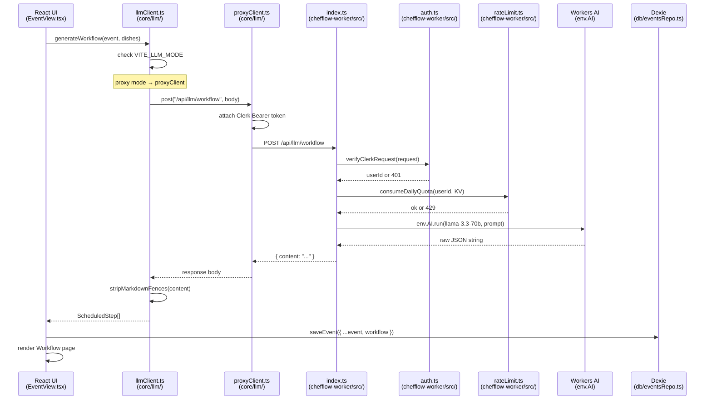

# Documentation Plan: ChefFlow Contributor & Maintainer Docs

**Scope:** Structure + section outlines for every file under `docs/`. No prose written yet.
**Word budget:** ~800 words.

---

## 1. Documentation structure

### `docs/README.md` — extend existing scaffold

Status: **usable as-is.** Contains project summary, feature table, top-level layout tree, tech stack, and the full docs index table. No gaps identified.

Suggested H2 sections (already present or to confirm):
- Who it is for
- Features
- Project layout (top level)
- Documentation
- Tech stack at a glance

No additional sections needed. Do not duplicate CLAUDE.md content here.

---

### `docs/architecture.md` — extend existing scaffold

Status: **usable as-is.** Contains system overview ASCII diagram, LLM mode switching explanation, data flow diagram, full annotated folder tree, state management table, and routing table. The Mermaid diagram below (section 2) should be added as a new `## Request lifecycle (Mermaid)` section.

Suggested H2 sections:
- System overview
- LLM mode switching
- Data flow
- Folder tree
- State management
- Routing
- **Request lifecycle (Mermaid)** ← add this; see section 2 below

---

### `docs/getting-started.md` — extend existing scaffold

Status: **usable as-is.** Complete end-to-end setup guide. One gap: no mention of the `functions/` directory or how it fits in local dev.

Suggested H2 sections:
- Prerequisites
- Clone the repository
- Install SPA dependencies
- Configure environment variables
- Start the development server
- Verify the setup
- Available scripts
- Cloudflare Worker (optional)
- Demo data

---

### `docs/deployment.md` — extend existing scaffold

Status: **usable, with one open TODO.** The `_routes.json` / Pages Functions wiring (Tasks 18–22 of the deploy plan) is marked `TODO: confirm with maintainer`. Once that is confirmed, add a concrete `## Cloudflare Pages routing` subsection with the actual file content.

Suggested H2 sections:
- Target architecture
- Environment variables (SPA + Worker subsections)
- Build command
- Worker deployment
- Worker endpoints
- Rate limiting
- Cloudflare Pages routing ← needs the `_routes.json` content filled in
- Local development with proxy mode

---

### `docs/data-model.md` — extend existing scaffold

Status: **usable as-is.** All domain types are documented with full TypeScript signatures, the Dexie schema history is complete, the recipe Markdown format is shown with front matter, ingredient syntax, step tag attributes, and Timer syntax. Repo helper table is present.

Suggested H2 sections:
- Dexie schema
- Core types (Recipe, Ingredient, WorkflowStep, AllergenTag, RecipeAnalysis, KitchenEvent, Dish, EventSection, ScheduledStep, MenuAnalysis, ColorTag)
- Recipe Markdown format
- Repository helpers

---

### `docs/contributing.md` — extend existing scaffold

Status: **usable as-is.** Covers prerequisites, branching, commit style, dev commands, code standards, testing conventions, state-persistence protocol, and PR checklist.

One gap: no explicit pointer to the agent protocol in CLAUDE.md or how to invoke project agents (see section 3 below). Add a single `## Agent protocol` section that cross-references CLAUDE.md rather than duplicating it.

Suggested H2 sections:
- Prerequisites
- Branching
- Commit style
- Development commands
- Code standards
- Testing conventions
- State-persistence protocol
- **Agent protocol** ← add cross-reference to CLAUDE.md
- Pull request checklist

---

### `docs/ui-conventions.md` — extend existing scaffold

Status: **usable as-is.** Covers dark mode, surface tokens, accent color, border tokens, touch targets, CSS utilities, animations, typography, layout structure, bottom navigation, primitive components, command palette, and color tags.

Suggested H2 sections:
- Dark mode
- Surface token system
- Accent color
- Border tokens
- Touch targets
- CSS utility classes
- Animations
- Typography
- Layout structure
- Bottom navigation (mobile)
- Primitive components
- Command palette
- Color tags

---

### `docs/unit-system.md` — extend existing scaffold

Status: **usable as-is.** Engine is fully documented. One intentional gap: the Zustand `UnitSystemStore` UI toggle is deferred.

Suggested H2 sections:
- Unit system modes
- Ingredient scaling syntax
- Portion scaling
- Unit conversion
- Normalization
- Chef-friendly rounding
- Unit selection during scaling
- **Deferred: unit toggle UI** ← pointer to `ToDoList.md § Unit System Toggle`

---

## 2. Architecture document: Mermaid request lifecycle diagram

Add this as `## Request lifecycle (Mermaid)` in `docs/architecture.md`.

This traces a "Generate workflow" LLM request end to end.

---

## 3. Cross-referencing CLAUDE.md (agent protocol)

CLAUDE.md is the authoritative source for:

- The 12 engineering rules that govern all agent and human work in this repo
- The state-persistence protocol (`TODO_PERSISTENCE.md` vs. `ToDoList.md`)
- Agent invocation patterns (via Claude Code slash commands)

`docs/contributing.md` should add a single `## Agent protocol` section with this content:

> This project uses Claude Code agents for autonomous development sessions. The agent rules, state-persistence protocol, and product cycle are defined in [`CLAUDE.md`](../CLAUDE.md) at the repo root. Read it before starting any non-trivial task. Key points:
>
> - All agents must follow the 12 rules in CLAUDE.md.
> - In-flight agent work is tracked in `TODO_PERSISTENCE.md` (agent-owned; do not edit manually).
> - Human backlog lives in `ToDoList.md`.
> - To invoke an agent for a specific change type, use the appropriate Claude Code skill (e.g. `superpowers:writing-plans` before implementation, `superpowers:verification-before-completion` before claiming work is done).

Do not restate the 12 rules or the product cycle in `docs/contributing.md`. Cross-reference only.

---

## Status summary

| File | Status | Action |
|------|--------|--------|
| `docs/README.md` | Complete | No changes needed |
| `docs/architecture.md` | Complete + gap | Add Mermaid diagram section |
| `docs/getting-started.md` | Complete | No changes needed |
| `docs/deployment.md` | Complete + open TODO | Fill in `_routes.json` content when confirmed |
| `docs/data-model.md` | Complete | No changes needed |
| `docs/contributing.md` | Complete + gap | Add `## Agent protocol` cross-reference |
| `docs/ui-conventions.md` | Complete | No changes needed |
| `docs/unit-system.md` | Complete | No changes needed |
